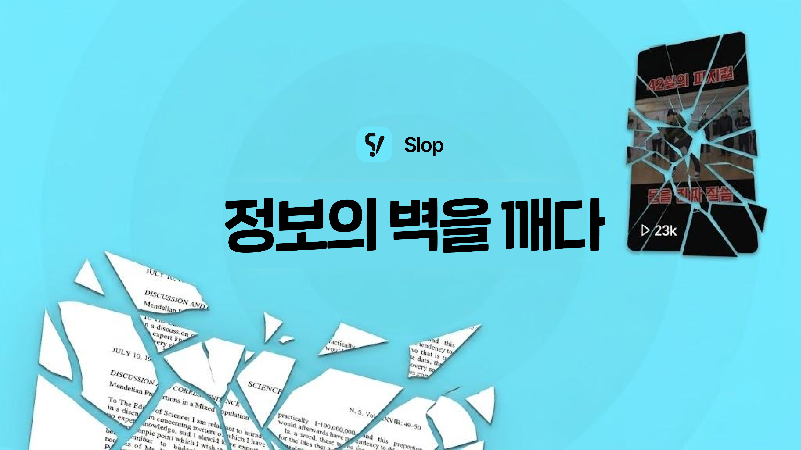

 

<h1>SLOP</h1>

웹에서 읽던 글을, 그 자리에서 숏폼으로.

  
  
  
  
  
  

<b>제 12회 선린 해커톤 금상 수상작</b>

---

## 소개

바쁜 일상 속에서 긴 뉴스 기사를 끝까지 읽기 어려운 사용자를 위해, SLOP은 웹에서 읽던 글을 그 자리에서 숏폼 영상으로 바꿔주는 Chrome 확장 프로그램과, 이를 틱톡 스타일 피드로 소비하는 Next.js 웹앱으로 구성된 프로젝트입니다.

플로팅 버튼을 누르면 서버가 사이트 분석 → 요약 → 쇼츠 영상 생성을 거치는 동안 진행 상황을 확인하다가, 완성되면 세로 영상을 바로 재생·공유할 수 있습니다. 특정 뉴스 페이지에서는 원문 문단 아래에 쉽게 풀어쓴 문장을 나란히 보여주는 인라인 재해석 기능도 제공합니다.

웹앱 온보딩에서는 말투, 표시 형식, 쇼츠 스타일, 관심 분야, 용어 난이도를 개인화해 저장하며, 완성된 쇼츠는 릴스 피드에서 좋아요·댓글·무한 스크롤로 소비할 수 있습니다.

## 구성

| 디렉터리 | 역할 |
|---|---|
| `extension` | Plasmo 기반 Chrome 확장 프로그램 — 페이지 파싱, 텍스트 선택 팝업, 릴스 피드 UI |
| `web` | Next.js 웹앱 — 온보딩, 릴스 피드, 구글 OAuth 로그인 |
| `backend` | NestJS API 서버 — 인증, 파일 업로드, 쇼츠 생성·추천, 검색 |

## 역할

크롬 익스텐션(Plasmo 기반)과 Next.js 웹 프론트엔드를 모두 설계·구현한 풀스택 프론트엔드 개발자 역할을 수행했습니다. 페이지 파싱, 텍스트 선택 팝업, 릴스 피드 UI, 구글 OAuth 로그인·온보딩까지 전 영역을 개발했습니다.

## 느낀점

뉴스 사이트의 클라이언트 사이드 하이드레이션 구조(JSON blob 파싱, 유니코드 따옴표 정규화 등)를 다루면서, 외부 페이지를 대상으로 한 확장 프로그램은 예상보다 훨씬 지저분한 예외 케이스를 세심히 처리해야 안정적으로 동작한다는 것을 느꼈습니다.

## 기술 스택

**Frontend & Backend** &nbsp;TypeScript · Docker · React · Next.js · NestJS
